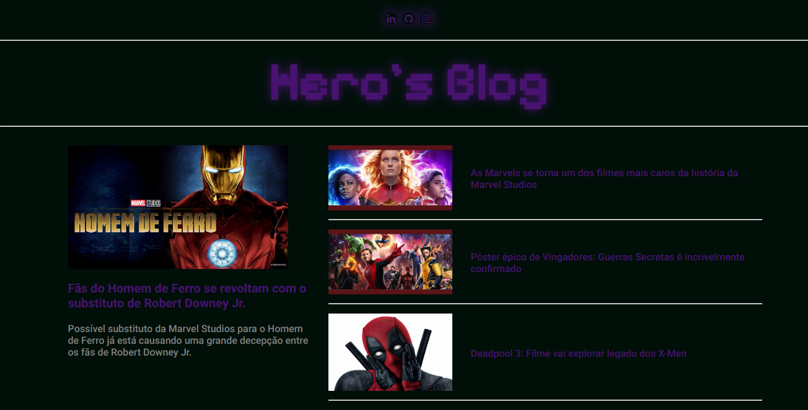

# Criando um Blog com Angular - DIO.me

Projeto de conclusão do módulo básico de Angular da DIO.
Bootcamp Santander Full Stack 2023, Prof. Felipe Aguiar

[ 🔗 Clique aqui para acessar!](https://mathferreira14.github.io/project-angular)

## 🛠 Tecnologias

- TypeScript
- HTML
- CSS
- Git & Github

## 😍 Contato

dev.matt1407@gmail.com